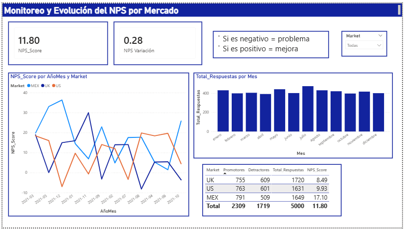

## Strategic NPS Analysis – Financial Services
Power BI | DAX | Data Modeling | Customer Experience Analytics

## 📌Project Overview

This project analyzes the publicly available Kaggle dataset “Net Promoter Score (NPS) for Financial Services” to simulate a real-world Customer Experience & Strategy environment.

Using Power BI and DAX, I designed a star schema data model and built an executive dashboard to monitor NPS evolution, detect structural deterioration trends, and identify potential retention risks across markets (MEX, US, UK).

## 🎯 Business Objective
- Monitor NPS evolution over time
- Identify structural deterioration in customer perception
- Detect growth in detractors (retention risk signal)
- Simulate impact measurement of CX improvements

## 🧱 Data Modeling

- Star schema design
- Calendar table built with DAX
- Time intelligence functions (DATEADD, monthly variation)
- Measures for Promoters, Detractors, Total Responses, NPS %

## 📈 Key Insights

- Sustained downward trend in MEX market
- Increase in detractors without reduction in survey volume
- Recent positive variation (+1.68) suggests short-term recovery
- Structural risk if detractor growth continues

## 📂 Data Source

- Dataset: Net Promoter Score (NPS) for Financial Services
- Source: Kaggle
This dataset is publicly available and used for educational and analytical purposes only.

## 🚀 Strategic Value

- This project demonstrates the ability to:
- Translate customer metrics into business risk signals
- Perform relational NPS analysis
- Use dashboards for executive-level decision-making
- Apply analytical thinking in financial services context

## 📌 Future Improvements

- Add driver analysis to identify root causes of detractors  
- Implement churn risk modeling  
- Segment NPS by customer profile  
- Simulate financial impact of NPS variation

## 📊 Dashboard Preview

